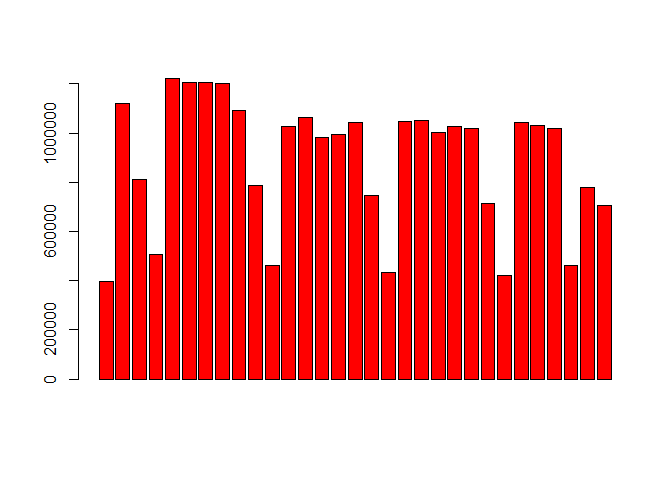

# Dados do STPP - Fortaleza
Mario  
Tuesday, June 23, 2015  

###Carregando os pacotes necessários

```r
library(data.table)
library(dplyr)
library(tidyr)
library(knitr)
```

###Leitura dos dados

```r
dados <- fread('TP.csv',sep=';')
head(dados)
```

```
##    mes dia dsem hora  ptot pcd0  pnin  pbus  inte meia grat
## 1:   1   1    4    0   825  372   823   825   700  103   22
## 2:   1   1    4    1  1329  748  1322  1329  1146  160   23
## 3:   1   1    4    2  1055  638  1054  1055   917  125   13
## 4:   1   1    4    3  1180  727  1179  1180  1036  135    9
## 5:   1   1    4    4  2464 1262  2460  2462  2174  249   41
## 6:   1   1    4    5 12305 6029 12169 11982 10936 1146  223
```

###Questão 1 - Agregar os dados por dia para o ano todo e apresentar uma tabela com os dados apenas do mês de maio. As colunas da tabela devem ser as mesmas do arquivo de entrada menos, é claro, a da hora. No final da tabela deve aparecer uma linha com os totais do mês.


```r
tdia <- group_by(dados,mes,dia,dsem) %>%
        summarise_each(funs(sum)) %>% 
        select(-hora) 
maio <- filter(tdia,mes==5) 
total = as.list(colSums(maio))
total[1:3] <- c('Total','','')
tabela <- rbindlist(list(maio,total))
kable(tabela, format = "markdown")
```


|mes   |dia |dsem |     ptot|     pcd0|     pnin|     pbus|     inte|    meia|   grat|
|:-----|:---|:----|--------:|--------:|--------:|--------:|--------:|-------:|------:|
|5     |1   |5    |   394847|   202831|   381685|   359286|   383654|    2881|   8312|
|5     |2   |6    |  1120012|   537466|  1059523|  1012817|  1075606|   20447|  23959|
|5     |3   |7    |   811700|   389236|   774843|   728512|   782744|   15215|  13741|
|5     |4   |1    |   504678|   273539|   490226|   455709|   487072|    7495|  10111|
|5     |5   |2    |  1221075|   560397|  1154437|  1107507|  1149659|   43365|  28051|
|5     |6   |3    |  1204895|   518844|  1134560|  1090013|  1112411|   65194|  27290|
|5     |7   |4    |  1207669|   505149|  1136186|  1089274|  1100279|   79713|  27677|
|5     |8   |5    |  1200646|   493227|  1128598|  1086168|  1086913|   87401|  26332|
|5     |9   |6    |  1092897|   407094|  1021859|   989214|   984115|   85197|  23585|
|5     |10  |7    |   786890|   323090|   746606|   703048|   725499|   47620|  13771|
|5     |11  |1    |   463214|   236066|   449184|   420374|   431595|   21892|   9727|
|5     |12  |2    |  1027996|   376913|   960209|   933770|   918818|   86924|  22254|
|5     |13  |3    |  1064120|   377984|   991297|   964376|   944349|   94657|  25114|
|5     |14  |4    |   983742|   338056|   915116|   893074|   873661|   88257|  21824|
|5     |15  |5    |   994088|   339587|   923515|   901911|   884442|   90521|  19125|
|5     |16  |6    |  1043361|   365811|   969860|   948474|   926875|   93621|  22865|
|5     |17  |7    |   744831|   298747|   703347|   667690|   678553|   53312|  12966|
|5     |18  |1    |   433524|   213095|   418822|   392213|   398035|   25997|   9492|
|5     |19  |2    |  1048493|   374370|   976022|   954740|   922214|  102414|  23865|
|5     |20  |3    |  1049277|   362277|   974501|   950645|   916993|  108067|  24217|
|5     |21  |4    |  1004078|   339167|   930757|   913140|   876076|  106548|  21454|
|5     |22  |5    |  1025452|   350294|   950584|   932778|   889617|  112730|  23105|
|5     |23  |6    |  1018271|   356611|   944954|   926245|   887063|  109728|  21480|
|5     |24  |7    |   714649|   291605|   674306|   641025|   642424|   59315|  12910|
|5     |25  |1    |   422639|   211814|   408553|   384089|   384214|   29220|   9205|
|5     |26  |2    |  1041149|   381846|   968636|   946562|   896335|  120187|  24627|
|5     |27  |3    |  1030833|   368903|   956656|   936449|   882357|  123864|  24612|
|5     |28  |4    |  1019448|   367008|   945382|   927651|   869560|  126152|  23736|
|5     |29  |5    |   462106|   160711|   429223|   331918|   399075|   50529|  12502|
|5     |30  |6    |   778711|   279102|   722476|   681339|   676578|   84482|  17651|
|5     |31  |7    |   704730|   280356|   665783|   626772|   631199|   60722|  12809|
|Total |    |     | 27620021| 10881196| 25907706| 24896783| 24817985| 2203667| 598369|

```r
barplot(maio$ptot,col='red')
```

 

###Questão 2 - Com os mesmos dados obtidos na questão anterior, gerar um arquivo tipo csv (usando o ";" como separador), com os dados de todos os dias do ano, incluindo um cabeçalho com os nomes das colunas.


```r
write.table(tdia,'dias_00.csv',sep=';',row.names=FALSE)
```

###Questão 3 - Agregar os dados por mês para o ano todo e apresentar uma tabela completa, incluindo uma última linha com o total do ano. As colunas da tabela devem ser as mesmas do arquivo de entrada menos as colunas dia, dsem e hora.


```r
tmes <- group_by(tdia,mes) %>%
        summarise_each(funs(sum)) %>%
        select(-c(dia,dsem))   
total = as.list(colSums(tmes))
total[1] <- 'Total'
tabela <- rbindlist(list(tmes,total))
kable(tabela, format = "markdown")
```


|mes   |      ptot|      pcd0|      pnin|      pbus|      inte|     meia|    grat|
|:-----|---------:|---------:|---------:|---------:|---------:|--------:|-------:|
|1     |  29680019|  10805222|  28147870|  26356480|  23979099|  4620753| 1080167|
|2     |  29462685|  10106198|  27789340|  26124843|  22990902|  5427486| 1044297|
|3     |  27761078|   9499555|  26195235|  24757786|  21854002|  4985286|  921790|
|4     |  29182603|   9835079|  27431523|  26194151|  23064951|  5422329|  695323|
|5     |  27620021|  10881196|  25907706|  24896783|  24817985|  2203667|  598369|
|6     |  23372027|   8596739|  21876742|  21193704|  20553717|  2331273|  487037|
|7     |  27642191|   9784019|  25792340|  25243374|  23741141|  3325622|  575428|
|8     |  29681094|  10477465|  27720738|  27291743|  24453419|  4640840|  586835|
|9     |  31143207|  10706356|  28995752|  28898083|  25124337|  5430000|  588870|
|10    |  31968460|  10776973|  29717924|  29961256|  25721852|  5672585|  574023|
|11    |  30514570|  10289511|  28414042|  28562385|  24352153|  5595861|  566556|
|12    |  30154192|  11139765|  28209129|  28295907|  24863040|  4746220|  544932|
|Total | 348182147| 122898078| 326198341| 317776495| 285516598| 54401922| 8263627|

###Questão 4 - Identificar e apresentar, no formato "diadomes/nomedomes (diadasemana)", quais foram os dias com a maior e a menor demanda de passageiros e os respectivos valores.


```r
dd = c('domingo','segunda-feira','terça-feira','quarta-feira','quinta-feira','sexta-feira','sábado','domingo')
mm = c('janeiro','fevereiro','março','abril','maio','junho','julho','agosto',
       'setembro','outubro','novembro','dezembro')
vmax = max(tdia$ptot)
dmax = tdia$dia[tdia$ptot==max(tdia$ptot)]
mmax = tdia$mes[tdia$ptot==max(tdia$ptot)]
dsmax = tdia$dsem[tdia$ptot==max(tdia$ptot)]
vmin = min(tdia$ptot)
dmin = tdia$dia[tdia$ptot==min(tdia$ptot)]
mmin = tdia$mes[tdia$ptot==min(tdia$ptot)]
dsmin = tdia$dsem[tdia$ptot==min(tdia$ptot)]
```

Dia com maior demanda total: 15/abril (terça-feira) com 1259252 passageiros.  
Dia com menor demanda total: 30/março (domingo) com 236979 passageiros.

###Questão 5 - Identificar e apresentar, no formato "nomedomes", quais foram os meses com a maior e a menor demanda de passageiros e os respectivos valores.


```r
vmax = max(tmes$ptot)
mmax = tmes$mes[tmes$ptot==max(tmes$ptot)]
vmin = min(tmes$ptot)
mmin = tmes$mes[tmes$ptot==min(tmes$ptot)]
```

Mes com maior demanda total: outubro com 31968460 passageiros.  
Mes com menor demanda total: junho com 23372027 passageiros.

###Questão 6 - Calcular e apresentar o percentual mensal de validações (viagens) integradas. Na saída de dados, usar o nome do mês e não o número.


```r
valid <- mutate(tmes,pint=ptot-pnin,pint=100*pint/ptot,mes=mm[mes]) %>%
        select(mes,pint)
kable(valid, format = "markdown")
```


|mes       |     pint|
|:---------|--------:|
|janeiro   | 5.162224|
|fevereiro | 5.679540|
|março     | 5.640426|
|abril     | 6.000424|
|maio      | 6.199543|
|junho     | 6.397755|
|julho     | 6.692129|
|agosto    | 6.604730|
|setembro  | 6.895420|
|outubro   | 7.039864|
|novembro  | 6.883689|
|dezembro  | 6.450390|

###Questão 7 - Calcular e apresentar o valor médio da demanda para cada dia da semana, considerando todos os dias do ano. Na saída de dados, os dias da semana devem aparecer com os seus nomes, isto é, domingo, segunda, terça, ...


```r
medDS <- group_by(tdia,dsem) %>%
        summarise(media = mean(ptot)) %>% 
        arrange(dsem) %>%
        mutate(dsem=dd[dsem])
kable(medDS, format = "markdown")
```


|dsem          |     media|
|:-------------|---------:|
|domingo       |  485766.3|
|segunda-feira | 1100023.2|
|terça-feira   | 1084850.9|
|quarta-feira  | 1078054.9|
|quinta-feira  | 1063253.3|
|sexta-feira   | 1074003.1|
|sábado        |  789127.0|

###Questão 8 - Calcular e apresentar os valores mensais de passageiros totais e equivalentes. Neste caso, as passagens inteiras têm peso 1, as meia-passagens têm peso 0,5 e as gratuidades 0 (zero). Apresentar linha com os valores anuais.


```r
tempMes <- mutate(tmes,peq = inte+0.5*meia) %>%
        select(mes,ptot,peq)
total = as.list(colSums(tempMes))
tempMes <- mutate(tempMes,mes=mm[mes])
total[1] <- 'Total'
tabela <- rbindlist(list(tempMes,total))
kable(tabela, format = "markdown")
```


|mes       |      ptot|       peq|
|:---------|---------:|---------:|
|janeiro   |  29680019|  26289476|
|fevereiro |  29462685|  25704645|
|março     |  27761078|  24346645|
|abril     |  29182603|  25776116|
|maio      |  27620021|  25919819|
|junho     |  23372027|  21719354|
|julho     |  27642191|  25403952|
|agosto    |  29681094|  26773839|
|setembro  |  31143207|  27839337|
|outubro   |  31968460|  28558145|
|novembro  |  30514570|  27150084|
|dezembro  |  30154192|  27236150|
|Total     | 348182147| 312717559|

###Questão 9 - Calcular e apresentar os valores totais mensais de passageiros do sistema de Ônibus e o de vans, com os respectivos valores percentuais. Apresentar linha com os valores anuais.


```r
tempMes <- mutate(tmes,pvan = ptot - pbus,percbus=100*pbus/ptot,percvan=100*pvan/ptot) %>%
        select(mes,pbus,percbus,pvan,percvan)
total = as.list(colSums(tempMes))
tempMes <- mutate(tempMes,mes=mm[mes])
total[1] <- 'Total'
total$percbus <- 100*total$pbus/(total$pbus+total$pvan)
total$percvan <- 100*total$pvan/(total$pbus+total$pvan)
tabela <- rbindlist(list(tempMes,total))
kable(tabela, format = "markdown")
```


|mes       |      pbus|  percbus|     pvan|   percvan|
|:---------|---------:|--------:|--------:|---------:|
|janeiro   |  26356480| 88.80210|  3323539| 11.197900|
|fevereiro |  26124843| 88.67095|  3337842| 11.329049|
|março     |  24757786| 89.18164|  3003292| 10.818355|
|abril     |  26194151| 89.75947|  2988452| 10.240526|
|maio      |  24896783| 90.14035|  2723238|  9.859652|
|junho     |  21193704| 90.67979|  2178323|  9.320214|
|julho     |  25243374| 91.32190|  2398817|  8.678100|
|agosto    |  27291743| 91.94992|  2389351|  8.050077|
|setembro  |  28898083| 92.79097|  2245124|  7.209033|
|outubro   |  29961256| 93.72130|  2007204|  6.278701|
|novembro  |  28562385| 93.60245|  1952185|  6.397550|
|dezembro  |  28295907| 93.83739|  1858285|  6.162609|
|Total     | 317776495| 91.26731| 30405652|  8.732686|


